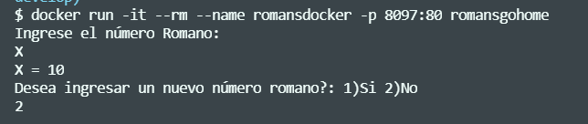
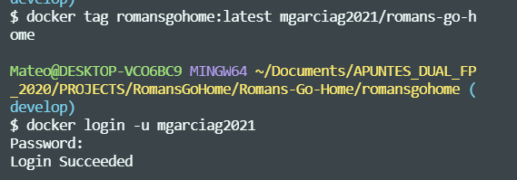
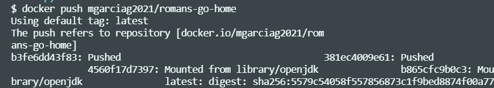
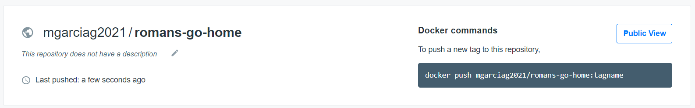

# Romans-Go-Home with Docker
Romans-Go-Home Kata Project consist of write a program that transforms numbers in Roman notation into Indo-Arabic notation. This kata  is solved by using regular expressions and enumerated types. This Kata is part of "Panel de Actividades" from Programación Subject

Docker is used in this project to generate a Image to upload to DockerHub and create a Container from this images. Where this images have the main things like maven and OpenJDK to execute and generated a JAR file.

[](URL_Proyecto)

<!--Logos-->


## Tabla de Contenidos

1. [Salida de la Aplicación](#salidas-de-la-aplicacion)
1. [DockerFile Maven Java](#dockerfile-maven-java)
1. [Execute-Jar.sh](#execute-Jar.sh)
1. [Metadata Docker](#metadata-docker)
1. [DockerHub Image](#dockerhub-image)
1. [Tecnologías Usadas](#tecnologias-usadas)
1. [Reflexiones](#reflexiones)
1. [Licencia](#licencia)

---

## Salida de mi Aplicación


**[⬆ back to top](#tabla-de-contenidos)**


---

## DockerFile Maven Java


```DockerFile

FROM maven:3.6.3-openjdk-11-slim AS build


COPY . /usr/src/app

RUN mvn -e -f /usr/src/app/pom.xml clean package

FROM openjdk:11.0-jre-slim-buster

LABEL "org.pingpong.romansgohome"="Romans Go Home" \
        version="1.0-SNAPSHOT" \
        description="Romans Go Home in Java With Docker" \ 
        maintainer="mgarciag@cifpfbmoll.eu"

WORKDIR $HOME/app 

COPY --from=build /usr/src/app/target/*.jar ./romansgohome-1.0-SNAPSHOT.jar

ENTRYPOINT ["java", "-jar", "romansgohome-1.0-SNAPSHOT.jar"]
```

**[⬆ back to top](#tabla-de-contenidos)**


---

## Execute-Jar.sh
### Create Container, run and execute Jar from Images All from the images created by DockerFile

```execute-jar.sh
docker run -it --rm --name romansdocker -p 8097:80 romansgohome
```


**[⬆ back to top](#tabla-de-contenidos)**

---


## Metadata Docker
Metadata Generated By DockerFile Labels

You can see the metadata generated by DockerFile about this images with this command:

```
docker image inspect romansgohome:latest
```


**[⬆ back to top](#tabla-de-contenidos)**


---


## DockerHub Images


Here you can pull and get my Romans-Go-Home Images in DockerHub:

https://hub.docker.com/repository/docker/mgarciag2021/romans-go-home

The steps that I followed were:

1. Create a tag to the Image
2. Login in Docker



3. Docker push the images to DockerHub



Result:





**[⬆ back to top](#tabla-de-contenidos)**


---

## Tecnologías Usadas

- Java JDK 11
- Maven
- Visual Studio Code
- Git
- Docker


**[⬆ back to top](#tabla-de-contenidos)**


---

## Reflexiones

### Que has mejorado con este proyecto?
With this task and project I learnt how to create an Image Docker with DockerFile with the main goal of use Java and Maven to generate the jar and execute it. At the same time how to create a container with this image.
I decided to use Romans-Go-Home Project because it's a Project and applicaciont that I want to prove if it works and with the use of Scanner Class from Java.util

**[⬆ back to top](#tabla-de-contenidos)**


---


## Licencia

MIT License

Copyright (c) 2021 Mateo Garcia Gonzalez

Permission is hereby granted, free of charge, to any person obtaining a copy
of this software and associated documentation files (the "Software"), to deal
in the Software without restriction, including without limitation the rights
to use, copy, modify, merge, publish, distribute, sublicense, and/or sell
copies of the Software, and to permit persons to whom the Software is
furnished to do so, subject to the following conditions:

The above copyright notice and this permission notice shall be included in all
copies or substantial portions of the Software.


**[⬆ back to top](#tabla-de-contenidos)**

---


## Autor
Mateo Garcia Gonzalez